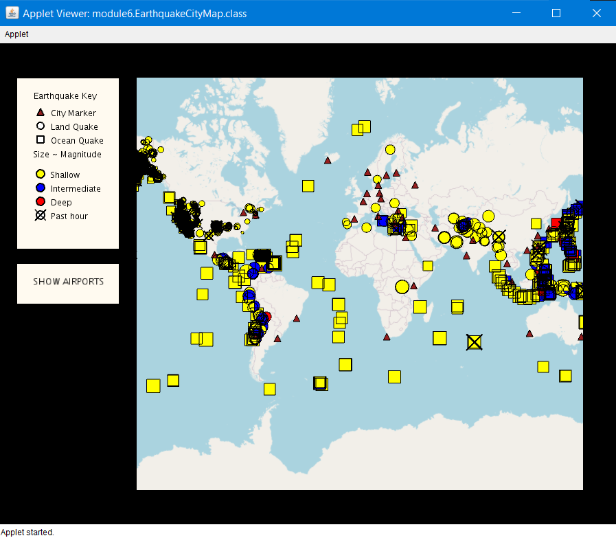
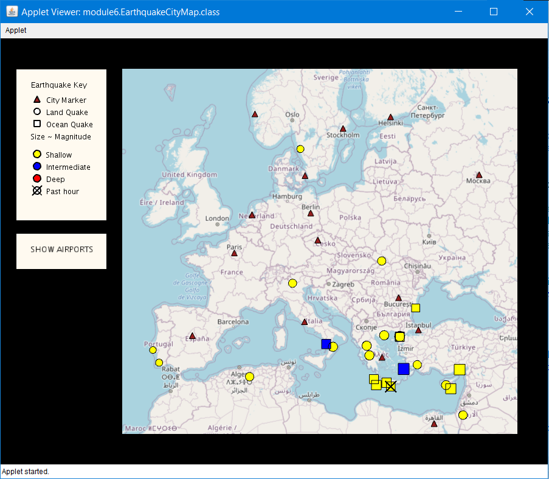
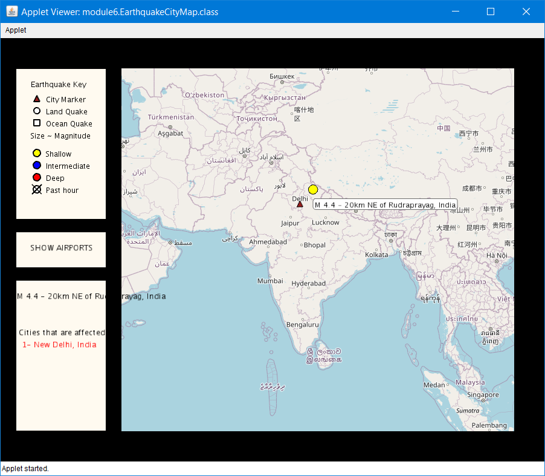
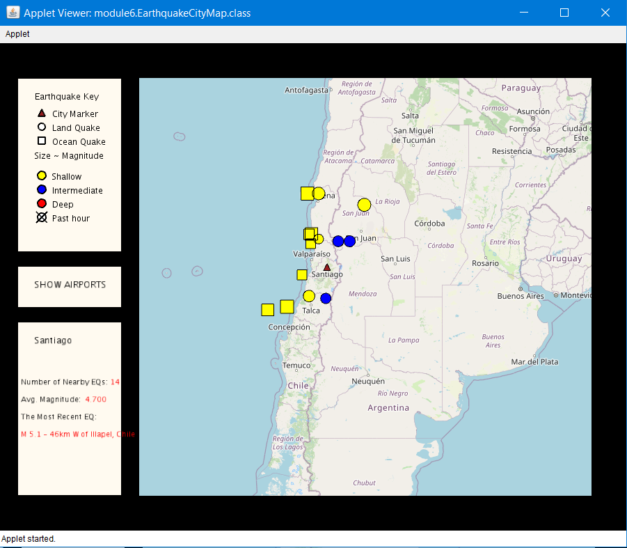
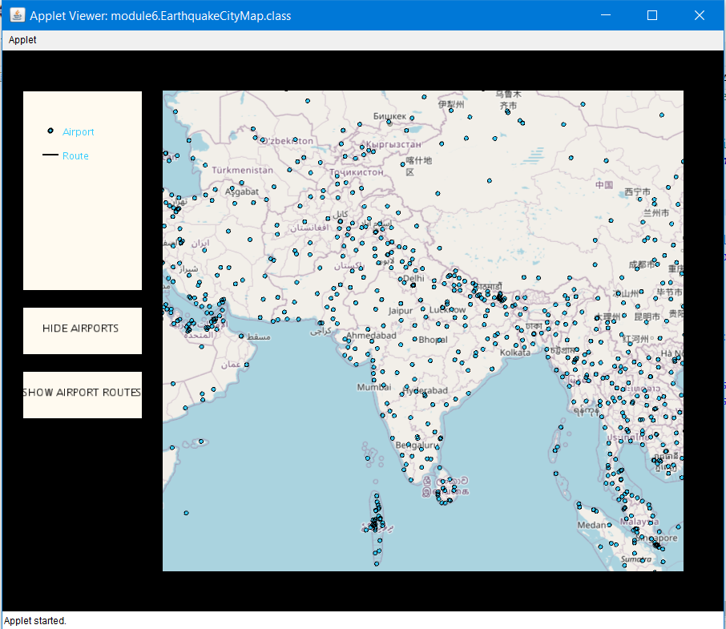
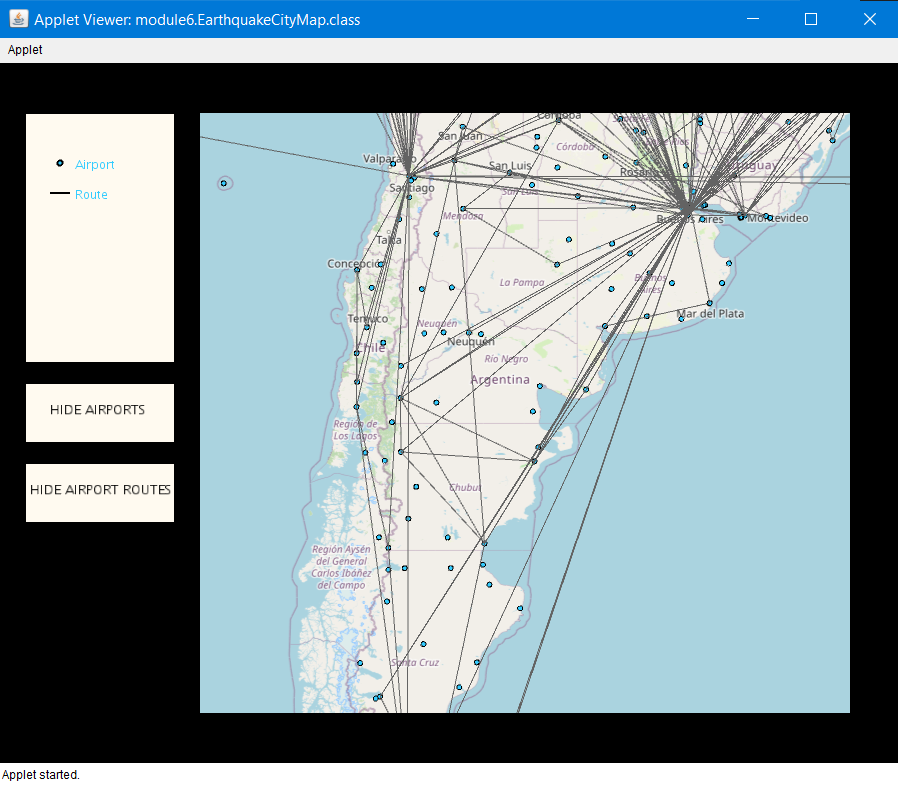

## Coursera - Object Oriented Programming in Java By University of California, San Diego 

#### Instructors: Mia Minnes, Leo Porter and Christine Alvarado

**Course Link -** https://www.coursera.org/learn/object-oriented-java

**Certificate Credentials -** https://www.coursera.org/account/accomplishments/certificate/MESSGVCBKHCV

## Course Description

This is a beginner/intermediate Java course. The main goal is to learn to create Java programs that are more advanced and personally interesting . We will also learn the fundamentals of Object Oriented Programming, how to leverage the power of existing libraries, how to build graphical user interfaces, and how to use some core algorithms for searching and sorting data. And this course is project-based, so by the end of this course we will have completed a cool project.

## Course Modules 

1. Welcome and Project Overview: Visualizing Data.
2. Memory Models, Scope, and Starting the Project.
3. Graphical output: Creating GUIs and Displaying Data.
4. Inheritance.
5. GUIs: Responding to User Events.
6. Searching and Sorting: From Code to Algorithms

## Tasks Completed

1. Learned and used Object Oriented Programming principles like Objects, Classes, Encapsulation, Inheritance, Polymorphism and Abstraction.
2. Used unfolding maps library and essentials of data cleaning and data visualization to create an interactive graphical map.
3. Used effecient searching and sorting techniques to disply data and implemented event driven programming.
4. Implemented graphical map that can display earthquake around the world with thier magnitude and other details.
5. Implemented graphical map that can also display location of various airports around the world.

## Project Screenshots

   

  

   
